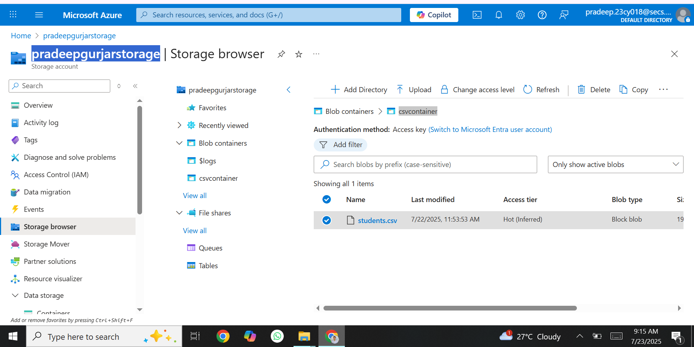
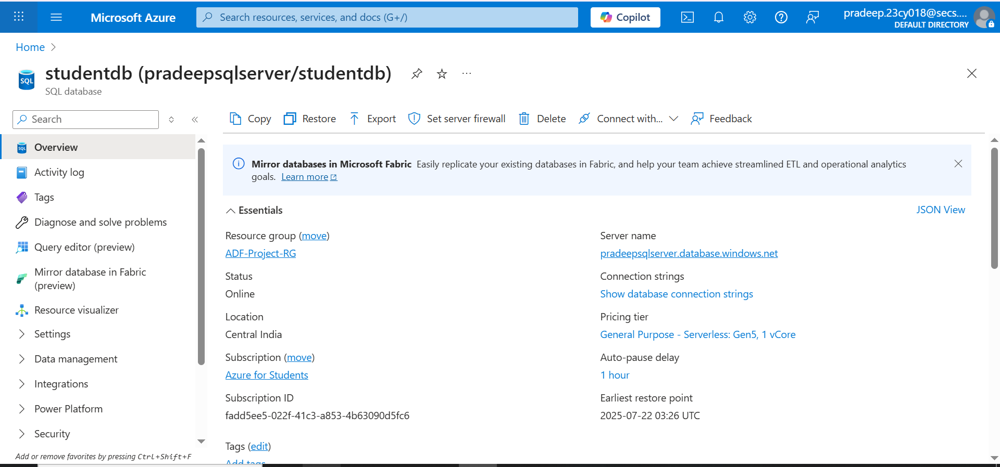
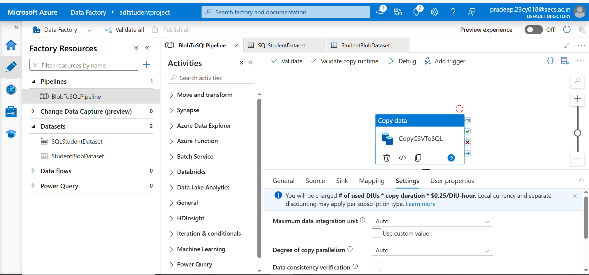
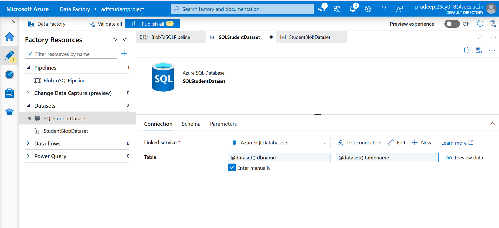
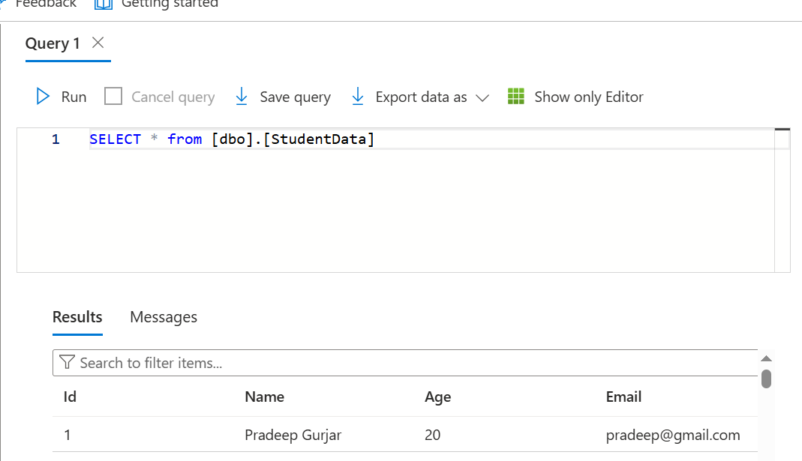

# Convert Unstructured Data into Structured Data

## My Celebal Tech Internship Project

This project shows how we can change unstructured data (like a CSV file) into proper structured data (rows and columns) using **Azure Data Factory (ADF)**.

---

## Project Goal
We upload any data in Azure Blob storage,our goal is to trigger an schedule Azure Data Factory pipelin that convert this unstructred data into structured data in SQL database where it can be stored in table format (structured form). The specific table to be copied will be passed as a parameter during runtime.

---

## Tools Used

- Azure Storage Account  
- Azure Blob Storage  
- Azure SQL Database  
- Azure Data Factory (ADF)
---

## How I created this Project

### 📁 Step 1: Upload CSV File to Blob Storage

- First, I created a **Storage Account** in Azure named **pradeepgurjarstorage**.
- Then I created a **Container** inside Blob Storage **csvcontainer**.
- After that, I uploaded our an CSV file named **students.csv** into the container.

---

### Step 2: Create Azure SQL Database

- After that, I created a new **Azure SQL Database** named **studentdb**.

---

### 🗃️ Step 3: Create Azure Data Factory & Create Pipeline

- I created a Azure Data Factory pipeline named BlobtoSQLPipeline.
- I added a "Copy Data" activity to the pipeline.

### 🧩 Step 4: Creating a New Dataset

- I craeted a new dataset selecting "Azure SQL Database" as the source named "SQLStudentDataset".
- A new linked service is established to connect to the Azure SQL database, requiring the server name, database name, username, and password.
- Instead of directly selecting a table name, I created parameters for both the DB name and Table name within the dataset's parameters section. These parameters are then used in the connection settings for the table.
- In the "Copy Data" activity's source settings, the created DB name and Table name parameters are dynamically passed from the pipeline's parameters.

---

### 🧾 Step 5: Create Dataset for SQL Table (Sink)

- Now I created a dataset for the sink, choosing "Azure Blob Storage" and "DelimitedText" (CSV format).
- Alos created new linked service for the storage account.

---

### 📦 Step 6: Created a trigger and run pipeline.

- Created a trigger and run piepline.

### 📊 Step 7: Verify Data in Azure SQL Table

- Finally, I checked the Azure SQL table.
- Our CSV data was successfully inserted as rows in the table.

## 📎 Project Submitted By:

**Name:** _Pradeep Gurjar
**Role:** Cloud infra & Security Intern
**Company:** Celebal Technologies  
**Date:** 23rd July 2025

---
